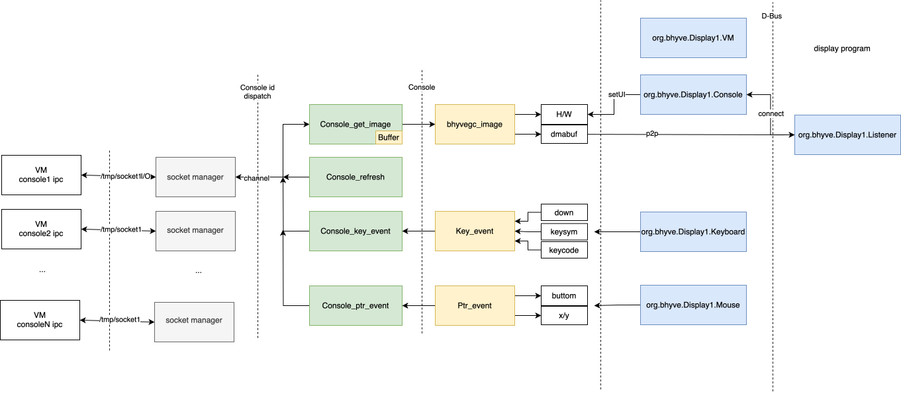
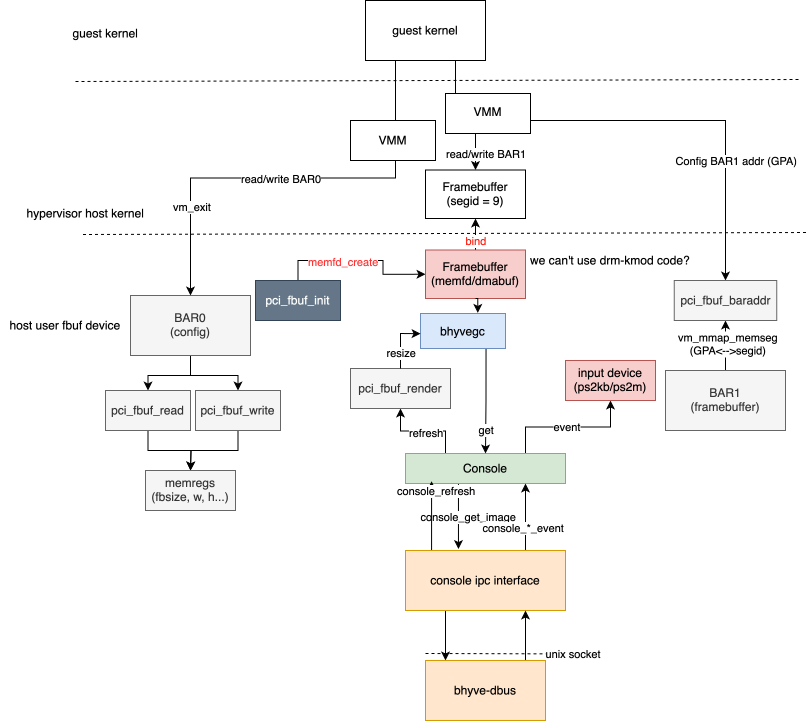

# bhyve-dbus

As the name suggests, bhyve-dbus sits between the socket interfaces exposed by
bhyve (e.g. the console interface) on one side and exposes a D-Bus server on
the other.

Currently the only interface bhyve exposes is the console interface, and only
bhyve's fbuf device exports it (as of writing), letting external programs
connect and render its output.

The bhyve-dbus architecture:

The relationship between bhyve's fbuf and bhyve-dbus:

The D-Bus interface follows QEMU's `org.qemu.Display1` definition (see
[`dbus-display1.xml`](./dbus-display1.xml), copied from QEMU's
`ui/dbus-display1.xml`).
